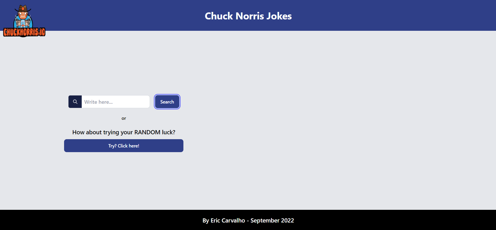
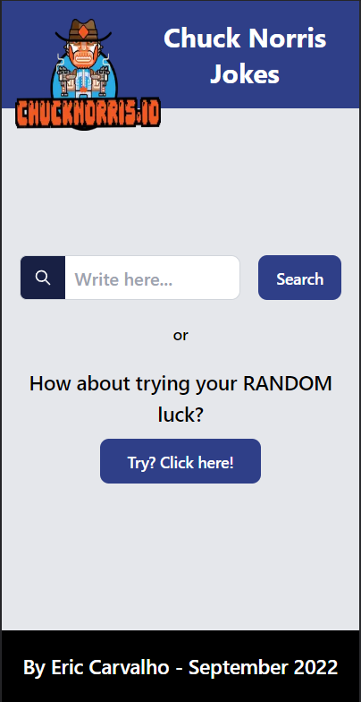
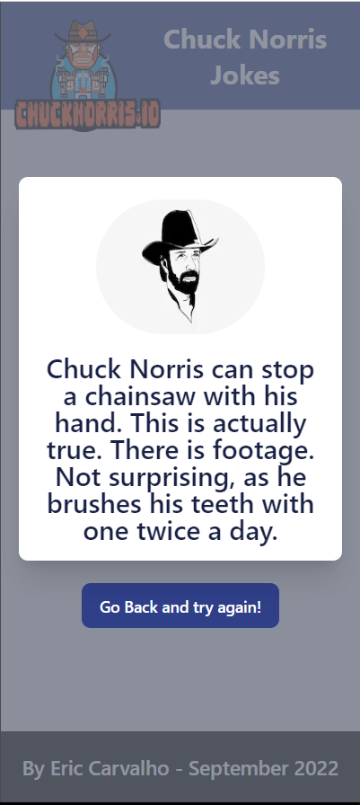

# Nuuvem FrontEnd Testing

The project was developed using Javascript as a base. As a framework I used React associated with Next Js. And why Next js? Even not taking full advantage of the framework such as SSR (Server side rendering), automatic routes (created when creating folders inside the Pages folder), dynamic routes and using only some of its Tags, I believe that NextJs is the best way to optimize of applications in React. Only its implementation can provide improvements both in optimization and in Google ranking SEO. Despite being a small project, I used reusable componentization, inspired by the theory of the organization of atoms to form cells, tissues, organs, systems, etc. There was no need to create contexts.

## 🚀 Project Access
The project was uploaded to github below and will be sent in a zip file to the recruiter Luciana at Nuuvem:

gitHub: https://github.com/ericsporto/nuuvem

### 🛠 Technologies
The following tools must be installed due to project dependency.

Node.js - (v16.0.0)
Typescript - (4.8.2)
Next.js - (v12.2.5)
TailwindCss - (v3.1.8)

In addition to the above technologies, the following libs were used for better development and user experience:

Styled-components - (5.3.5) => Associated with the tailwind, it provides further reinforcement with its classes and ease of responsiveness.
Twin.macro - (2.8.2) => Joins tailwind and styled-components.
React-toastify - (9.0.8) => Used for a better user experience when getting answers to your requests. Very important when handling errors.
Axios - (0.27.2) => To make requests.
React-query - (4.2.3) => Important ally to axios in the handling of requests. It has its own context that allows a smaller number of requests, in addition to having extremely interesting configuration methods regarding the quality of control of the requests themselves.
Heroicons and headlessui - react icons lib.
Testing-library/react - (13.3.0) => To realize tests.

#### ✅ Run in development
After cloning the repository, you will need to install the project's dependencies by running the commands in the terminal:

npm i
yarn
yarn build
yarn dev
